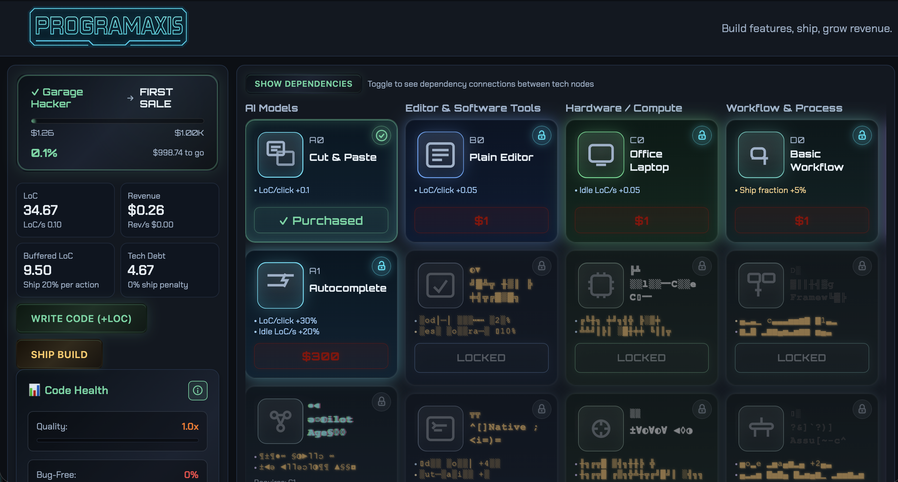

# 🚀 Programaxis

> **Build features, ship, grow revenue.**

A futuristic coding-themed idle game where you automate software development, manage technical debt, and scale your way to programming mastery. Experience the thrill of building a tech empire with stunning Three.js particle effects and a sprawling tech tree!



## 🎮 How to Play

### The Basics
- **Write Code**: Click to generate Lines of Code (LoC) - your primary resource
- **Ship Build**: Convert your LoC into Revenue to fund your growth
- **Manage Tech Debt**: Balance feature velocity with code quality

### Tech Tree Mastery
Programaxis features **8 specialized branches** with **40+ tech nodes**:

- 🔵 **Programming (A)**: Core coding skills and IDE improvements
- 🔷 **Automation (B)**: Build systems, CI/CD, and deployment tools
- 🟢 **Infrastructure (C)**: Servers, databases, and scaling solutions
- 🟡 **Testing (D)**: Quality assurance and testing frameworks
- 🟣 **Agents (E)**: AI assistants and automated code generation
- 🟠 **Revenue (F)**: Monetization strategies and business optimization
- ⚪ **Market (G)**: User acquisition and market expansion
- 🔴 **Quality (H)**: Code health, refactoring, and technical excellence

### Progression System
- **Milestones**: Revenue-based achievements that unlock new features
- **Idle Generation**: Keep earning even when away from the game
- **Agent Concurrency**: Scale your development with AI-powered automation
- **Quality Management**: Balance technical debt vs. development speed

### Epic Animations
- **Tech Purchase Effects**: Spectacular particle animations when unlocking nodes
- **Action Button Sparks**: Satisfying 3D effects on every click
- **Branch-Specific Themes**: Each tech tree branch has unique visual flair

## 🛠 Development Setup

### Prerequisites
- Node.js (v16 or higher)
- npm or yarn

### Quick Start
```bash
# Clone the repository
git clone <repository-url>
cd programaxis

# Install dependencies
npm install

# Start development server
npm run dev
```

Open [http://localhost:5173](http://localhost:5173) to play the game locally.

### Available Commands
```bash
# Development
npm run dev              # Start dev server
npm run build           # Production build
npm run preview         # Preview built app

# Analysis
npm run analyze         # Run progression analyzer
npm run analyze:save    # Save analysis to docs/
```

## 🚀 Deployment

The game includes production-ready deployment scripts for Ubuntu/DigitalOcean servers:

### Quick Deploy to Your Server

1. **Configure your server details** in `deploy.sh`:
   ```bash
   SERVER_USER="root"  # Your server username
   SERVER_IP="your.server.ip"  # Your server IP
   ```

2. **One-time server setup**:
   ```bash
   # Copy setup files to your server
   scp nginx-programaxis.conf setup-server.sh user@your-server:~/

   # Run server setup (creates directories, installs certbot, configures nginx)
   ssh user@your-server
   sudo ./setup-server.sh

   # Get SSL certificate
   sudo certbot --nginx -d your-domain.com
   ```

3. **Deploy your game**:
   ```bash
   chmod +x deploy.sh
   ./deploy.sh
   ```

### What's Included

- **`deploy.sh`** - Automated build and deployment via rsync
- **`nginx-programaxis.conf`** - Production nginx configuration with SSL, gzip, security headers
- **`setup-server.sh`** - One-time server setup script for Ubuntu/Debian

### Features
- HTTPS with Let's Encrypt
- Gzip compression for fast loading
- Security headers and CSP
- SPA routing support
- Static asset caching
- Mobile-optimized delivery

Perfect for DigitalOcean droplets, AWS EC2, or any Ubuntu VPS!

## 🎯 Game Features

### ✨ Core Gameplay
- **Idle Progression**: Continues earning while offline with time-based calculations
- **Deep Strategy**: Balance immediate gains vs. long-term tech investments
- **Resource Management**: LoC, Revenue, Tech Debt, and Quality metrics
- **Persistent Progress**: Local save data with IndexedDB storage

### 🎨 Visual Excellence
- **Tron-Inspired UI**: Cyberpunk aesthetic with glowing effects
- **Responsive Design**: Optimized for desktop and mobile
- **Particle Systems**: Hardware-accelerated Three.js animations
- **Performance Adaptive**: Auto-adjusts quality based on device capabilities

### 🔧 Technical Architecture
- **React + TypeScript**: Type-safe component architecture
- **Zustand + Immer**: Predictable state management
- **Three.js**: GPU-accelerated particle effects
- **Vite**: Lightning-fast development and building
- **CSS Grid/Flexbox**: Modern responsive layouts

## 💾 Save System

- **Local Storage**: Game data persists in your browser
- **Offline Progression**: Calculates idle earnings when you return
- **Data Management**: Built-in save/load with import/export capability
- **Reset Option**: Clear data button for fresh starts

## 🎪 Easter Eggs & Details

- **Matrix Rain**: Programming branch features iconic falling code
- **Spiral Mechanics**: Automation branch has mesmerizing spiral bursts
- **Sound Design**: Audio feedback on major tech purchases *(coming soon)*
- **Achievement System**: Hidden milestones for dedicated players
- **Dynamic Tooltips**: Contextual information throughout the interface

## 🤝 Contributing

This game is open source under the MIT license! Contributions are welcome:

1. Fork the repository
2. Create a feature branch
3. Make your changes
4. Submit a pull request

Check out `CLAUDE.md` for detailed development guidance and architecture overview.

## 📄 License

MIT License - see [LICENSE](LICENSE) file for details.

---

**Built with ❤️ and lots of ☕**

*Experience the future of idle gaming. Build your coding empire today!*